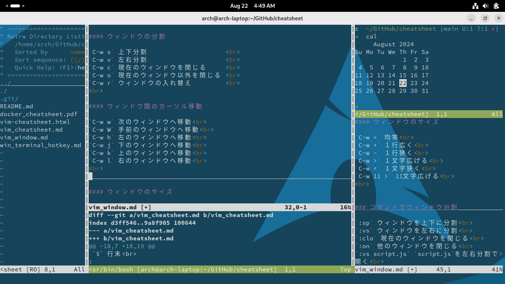

# Vim ウィンドウ操作

*便利なウィンドウ操作*
- 画面分割        
- バッファ        
- スクロール同期  
- ターミナル      
- ファイルエクスプローラ  
 

    

 

## ホットキー

基本的に`Ctrl + w` のあとそれぞれのコマンドを続ける 
vim, nvim共通、詳細は`:help window`
 

### ウィンドウの分割

`C-w s` 上下分割                      
`C-w v` 左右分割                      
`C-w n` 新しいウィンドウで新規ファイル作成 
`C-w c` 現在のウィンドウを閉じる      
`C-w o` 現在のウィンドウ以外を閉じる  
`C-w r` ウィンドウの入れ替え          
 

### ウィンドウ間のカーソル移動

`C-w h/j/k/l` それぞれの方向へ移動 
`C-w w/p` 次/前のウィンドウへ移動 
`C-w W` 手前のウィンドウへ移動 
 

### ウィンドウの入れ替え

`C-w H/J/K/L` ウィンドウ入れ替え 
`C-w r/R` ウィンドウ入れ替えローテーション 
`C-w x` ウィンドウ入れ替え 
`C-w T` 現在のウィンドウを新規タブに移動 

 

### ウィンドウのサイズ

`C-w =` 均等 
`C-w +` １行広く 
`C-w -` １行狭く 
`C-w >` １文字広げる 
`C-w <` １文字狭く 
`C-w 11 >` 11文字広げる 
 

## コマンド

### コマンドでウィンドウ分割

`:sp` 水平分割 
`:vs` 垂直分割 
`:new` 水平分割で新規ファイル作成 
`:vnew` 垂直分割で新規ファイル作成 
`:clo` 現在のウィンドウを閉じる 
`:on` 他のウィンドウを閉じる 
`:vs script.js` `script.js`を左右分割で開く 
 

### バッファ

`vi *.md` 現在のディレクトリのマークダウンファイルを全部開く 
 
`:ls` バッファのリスト 
`:bn` 次のバッファ 
`:bp` 前のバッファ 
`:b3` ３番バッファに移動 
`:sbn` 次のバッファを分割表示 
`:ball` 全バッファを分割表示 

> `:help buffer-list` マニュアル
 

### スクロール同期

`vi -O file1 file2` 複数のファイルを垂直分割で開く 
 
`:set scb` スクロール同期 
`:set noscb` スクロール同期解除 
`:windo set scb` すべてのウィンドウでスクロール同期 

> `:help scrollbind` マニュアル

翻訳するとき原文と翻訳文を同期すると便利
 

### ターミナル

`:term` ターミナル開く 
`:vert term` 左にターミナル開く 
 

> `:help terminal` マニュアル 
> 環境次第で挙動変わる

### ファイルエクスプローラ

`:E` 開く 
`:S` 上に開く 
`:Ve` 左に開く 

ファイル/ディレクトリにカーソル移動して

`Enter` 開く 
`-` 親ディレクトリに移動 
 
> `:help explore` マニュアル

